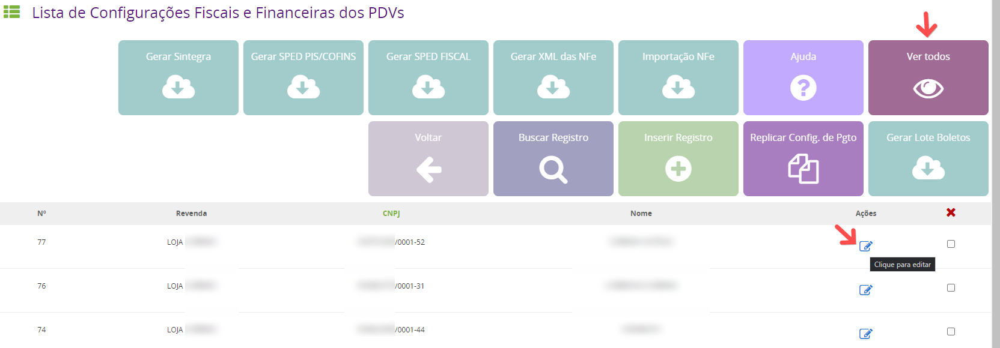
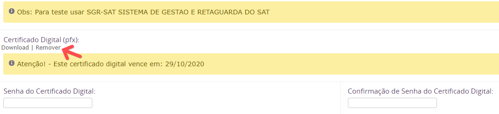
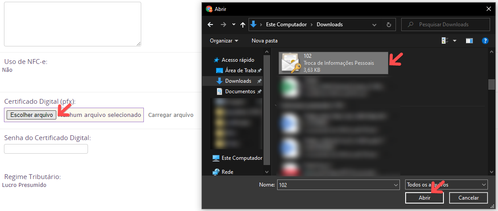
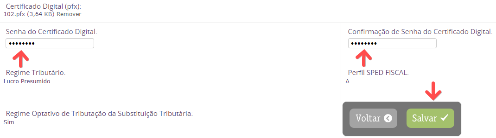

Para alterar o certificado digital da loja você deve acessar o menu abaixo :

- Configurações > Rede > Configurações Fiscais e Financeiras

 Busque a filial desejada clicando em VER TODOS ou BUSCAR REGISTRO e clique em Ações para editar.

Ao abrir a edição da filial acessar a aba Informações da Filial Fiscal, vá para o final da página e clique na opção Remover para apagar o certificado antigo.

Em seguida clique no botão Escolher arquivo e selecione o certificado.

Em seguida insira a senha nos campos Senha do Certificado Digital e Confirmação de Senha do Certificado Digital e clique em Salvar

Caso ainda precise instalar o certificado no computador ou exportar para o formato pfx, acesse o link abaixo com a demonstração de como fazer o procedimento :

https://before.atlassian.net/wiki/spaces/SYSCOR/pages/609386515/Certificado+Digital+-+Procedimentos
