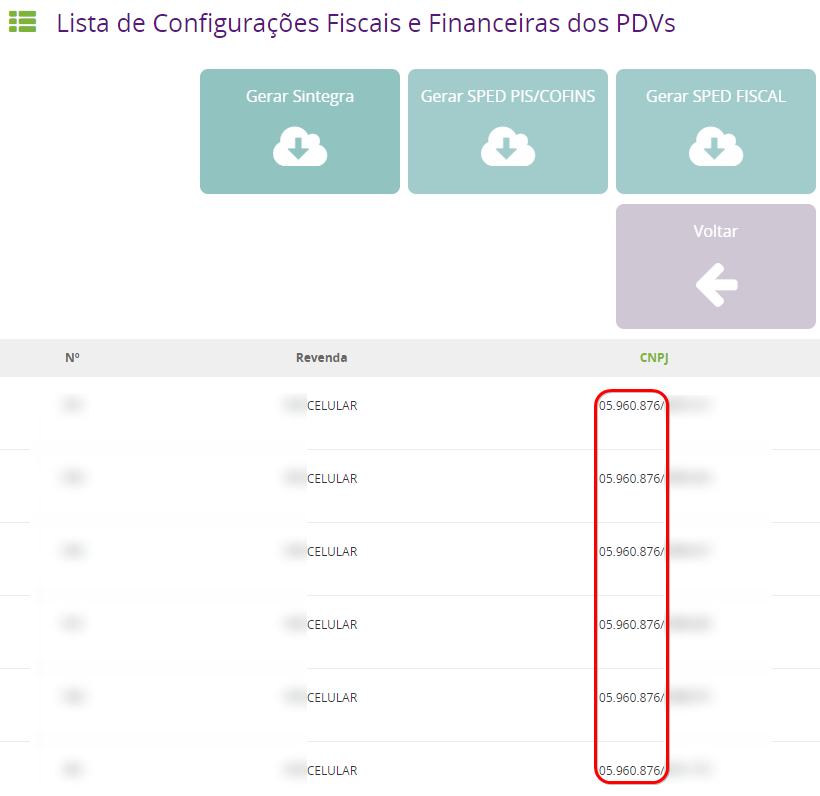

Os certificados digitais modelo A3 não são compatíveis com o sistema VIVO GO. Esse modelo de certificado é físico ou seja, deve ser conectado ao computador. Isso limitaria a emissão de comprovantes fiscais a apenas uma máquina.

Por esse motivo o sistema utiliza o modelo A1, que é instalado no sistema e não na máquina local, permitindo que de qualquer aparelho que esteja usando o VIVO GO você possa emitir seus comprovantes fiscais.

**Tenho várias filiais, tenho que adquirir um certificado para cada uma delas ?**

Adquirindo o certificado modelo A1, você pode usar o mesmo arquivo para validar as operações de todos os CNPJ's com a mesma raiz ou seja com a numeração igual até a barra.

Conforme exemplo abaixo :

___
Caso tenha duvidas quanto a instalação do certificado na maquina e/ou importação dele no sistema clique [AQUI](https://before.atlassian.net/wiki/spaces/SYSCOR/pages/609386515/Certificado+Digital+-+Procedimentos)

__Vale ressaltar que a extensão do arquivo do certificado digital deve ser (.pfx) para ser importado no sistema__.
