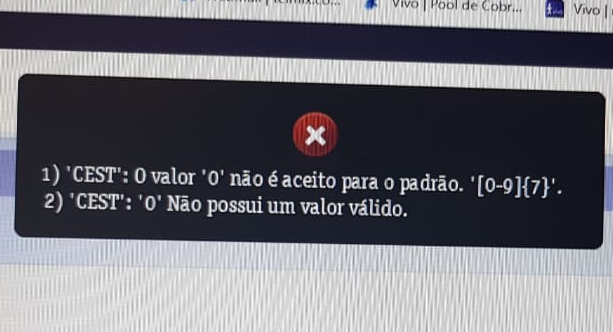

Ao tentar realizar a venda de um 'Produto Open' e não conseguir finalizar a venda nem emitir a nota fiscal devido ao erro abaixo:

> Erro 
>
> 1)'CEST': O valor '0' não é aceito para o padrão. '[0-9]{7}'
>
> 2)'CEST': '0' Não possui um valor válido.

Siga os seguintes procedimentos:
1. Verifique o CEST definido no "Tipo de Produto" (Gestão de Estoque > Produtos Open > Tipo Produto) no TIPO que se informa o CEST correto para aquele MODELO
2. Verifique o CEST preenchido no momento da COMPRA. Busque a COMPRA pelo SERIAL deste produto (Gestão de Estoque > Estoque > Compra > Buscar Registro > Serial Produto), edite a compra e confirme qual o CEST foi informado.