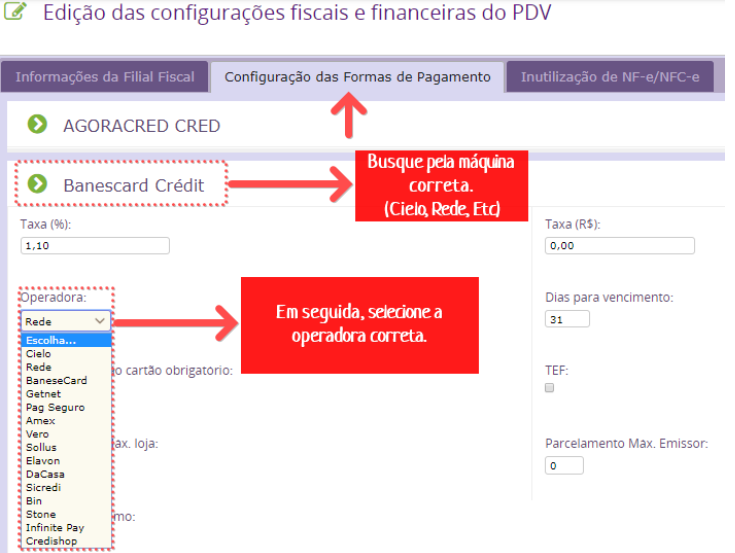

A SEFAZ de alguns estados (UFs) faz-se obrigatório o CNPJ da operadora da máquina de cartão para emitir NFe de vendas realizadas em cartão.

Esse erro geralmente ocorre quando a Operadora do Cartão não foi configurada corretamente na forma de pagamento que está sendo usada na venda.

Para correção, identifique a operadora na Forma de Pagamento da venda.

Após isso, busque e atualize a forma de pagamento na Filial Fiscal (Configurações > Rede > Configurações Fiscais e Financeira). 

Ao clicar no botão EDITAR do PDV que deseja atualizar, clique na aba "Configuração das Formas de Pagamento" e selecione a operadora da(s) máquina(s) utilizada(s) neste PDV e salve.

Por fim, realize o envio da nota novamente.