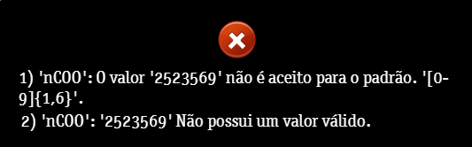

Este erro ocorre quando o número do comprovante da venda está preenchido de forma incorreta.

> 1)'nCOO': O valor '2523569' não é aceito para o padrão. '[0-9]{1,6}'.
>
> 2)'nCOO': '2523569' Não possui um valor válido.

> 1)'nCOO': O valor '' não é aceito para o padrão. '[0-9]{1,6}'.
>
> 2)'nCOO': '' Não possui um valor válido.

No primeiro exemplo o cliente colocou o número de nota '2523569' contendo 7 caracteres.

No segundo exemplo campo vazio e é requerido ao menos 1 dígito.

Para correção, deve-se colocar um número contendo de 1 a 6 dígitos.

#### **Dica**

Na maioria dos erros retornados pelo sistema, possui a sequência de [] (colchetes) e {} (chaves) no final da mensagem de erro.
* \[ \] = O número contido entre colchetes são os números aceitos
    * Exemplo [0-9] = Aceita de números entre 0 e 9
    * Exemplo [5-9] = Aceita de números entre 5 e 9
* \{ \} = Quantidade de caracteres esperados
    * Exemplo {1,6} = De 1 a 6 caracteres '5, 68, 1234, 666666'
    * Exemplo {1} = Apenas 1 caracter '1, 5, 9, 7'