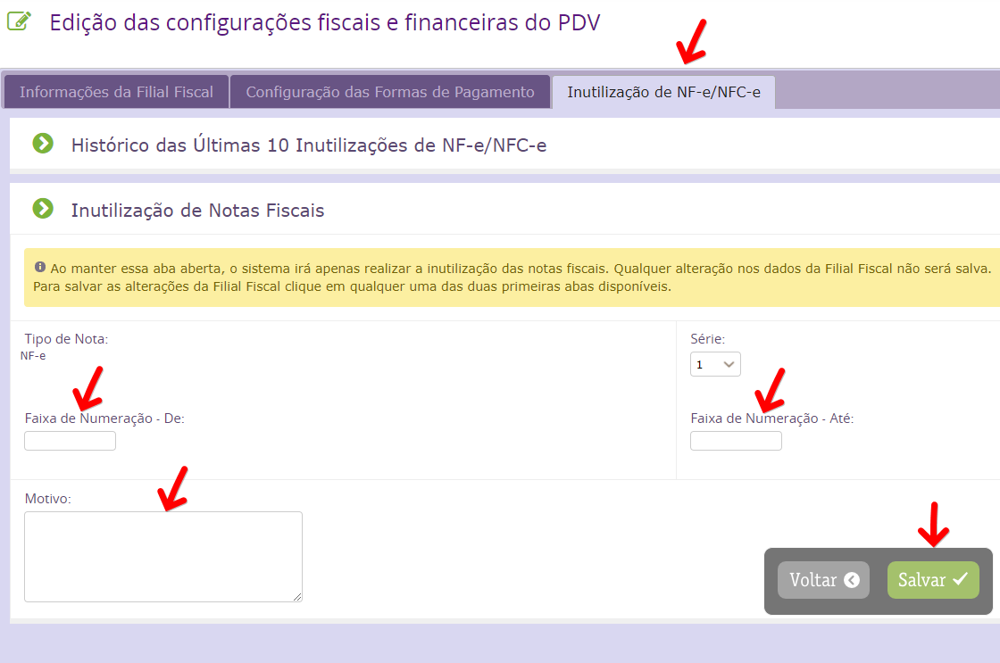

A inutilização de NF-e/NFC-e tem como principal finalidade permitir que o emissor comunique à SEFAZ os números de NF-e/NFC-e que não serão utilizados em razão de ter ocorrido uma quebra de sequência da numeração da nota fiscal eletrônica ou uma rejeição que não seja possível de ser corrigida. Segue abaixo o passo a passo para realizar a inutilização :

1 - O responsável fiscal da revenda deve acessar o caminho __Configurações > Rede > Configurações Fiscais e Financeiras__.
Buscar a filial desejada clicando em VER TODOS ou BUSCAR REGISTRO e clicar em Ações para editar.

2 - Ao abrir a edição da filial acessar a coluna _"Inutilização de NF-e / NFC-e"_ e informar a inutilização conforme demonstra na imagem abaixo.

___
- Tipo de Nota : Selecione qual nota você vai inutilizar NFe ou NFCe.
- Série : Informe a série da nota que irá inutilizar.
- Faixa de Numeração - De: Informe o início da numeração que irá inutilizar.
- Faixa de Numeração - Até: Informe o fim da numeração que irá inutilizar.
- Motivo : informe o motivo da inutilização dessa(s) nota(s).

3 - Após esse procedimento solicito que informe o suporte pelo e-mail cs.vivogo@before.com.br para ser desvinculada a NF do movimento. Se não for informado ao suporte a NF continuará aparecendo como pendente no sistema.

4 - Também é válido para minimizar as notas pendentes orientar as filiais para acionarem o suporte sempre que tiver uma NF pendente, pois pode ser tratado no mesmo momento evitando a necessidade de inutilizar depois.
