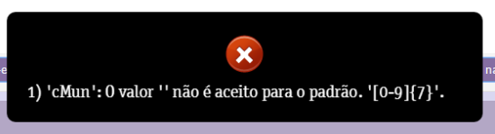

Esse erro ocorre devido ao campo CIDADE do cadastro do cliente, constar um distrito e não o nome da cidade desse distrito.

Como distrito não tem código, ocorre este erro.

Para este caso é necessário alterar o campo informando a CIDADE "responsável" por este distrito. Por fim, deixe registrado o nome do DISTRITO no campo Complemento.

