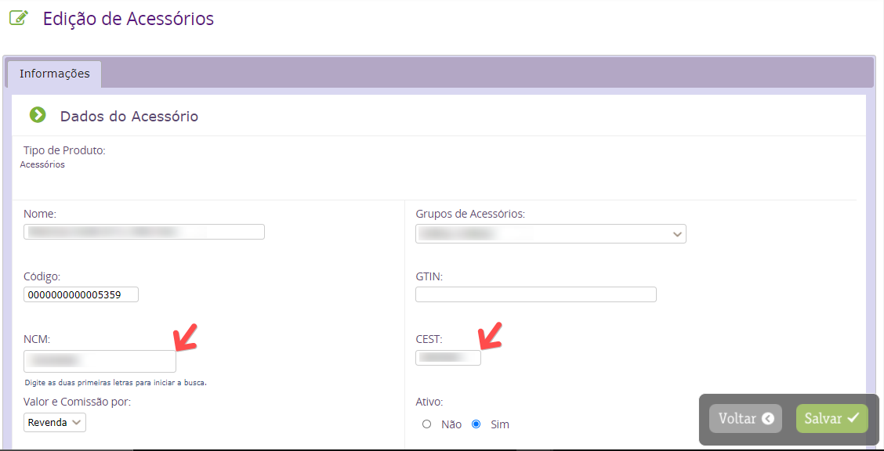
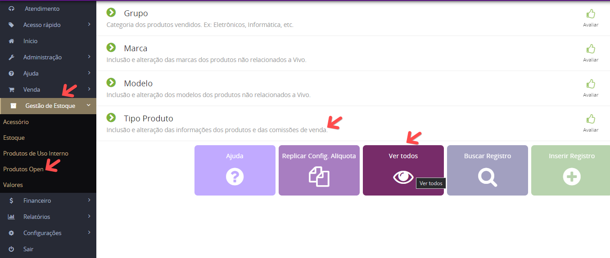

Os códigos NCM e CEST precisam ser informados no cadastro dos PRODUTOS OPEN e ACESSÓRIOS, para os produtos Vivo já é informado automaticamente pelo sistema.
NCM/CEST no cadastro de Acessórios – Acessar Gestão de Estoque > Acessório > Acessório.

OBS: O Preenchimento errado, a informação de um código inválido ou o não preenchimento desse campo ocasionará a rejeição da NF, gerando atraso e retrabalho nos processos da Rede.

NCM/CEST no cadastro de Produtos Open – Acessar Gestão de Estoque > Produtos Open > Tipo de Produto.

