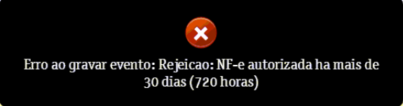

Ao tentar cancelar uma NF-e emitida há mais de 30 dias, a Sefaz rejeita o cancelamento.

Motivo: Cancelamento fora do prazo vigente da SEFAZ do Estado (UF).

Nesse caso, verifique o prazo de cancelamento no seu estado e oriente-o a procurar a contabilidade para verificar se há possibilidade de solicitar o cancelamento extemporâneo.