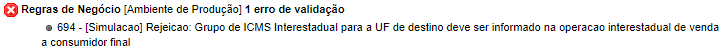

Este erro ocorre quando a operação é interestadual/externa (para fora do estado) e o destinatário está cadastrado como Pessoa Jurídica (PJ) e no cadastro consta a IE preenchida e a opção NÃO CONTRIBUINTE selecionada. 

Nesse caso é só alterar no cadastro para CONTRIBUINTE ICMS. 

Para isso, acesse o menu lateral "Configurações > Rede > Configurações Fiscais e Financeiras", busque pelo PDV que deseja alterar, neste caso o PDV de DESTINO e altere o campo "Tipo Insc. Estadual:" para "Contribuinte ICMS". Salve as configurações do PDV.

Após a alteração, volte ao MOVIMENTO e envie a nota fiscal.