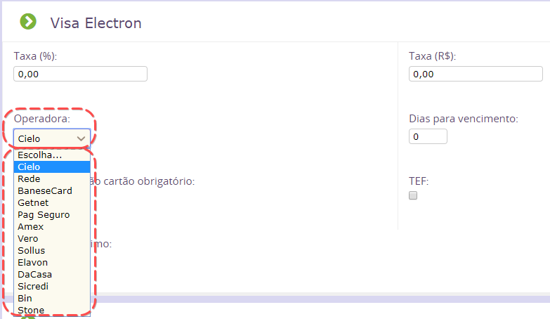
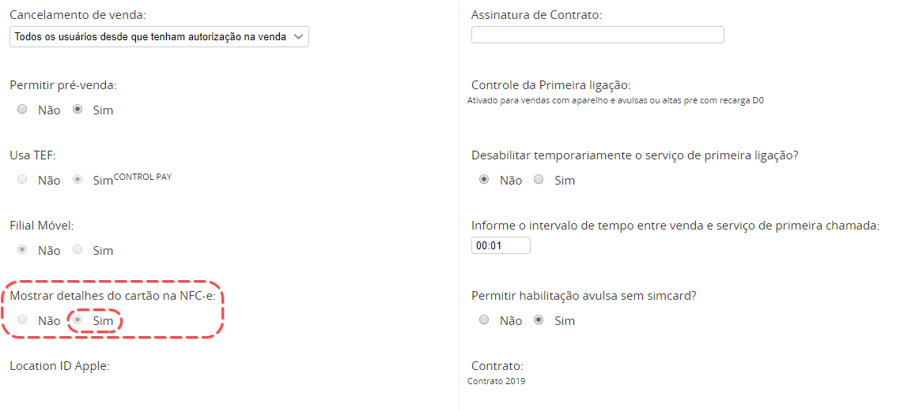

Nesse caso, deve-se verificar algumas configurações de sua filial:

1. Verifique se a 'Operadora' está configurada corretamente para a Forma de Pagamento utilizada

    * No menu lateral, acesse Configurações > Rede > Configurações Fiscais e Financeiras > Ver Todos > Localize a Filial > Clique em 'Editar'
    * No formulário de edição, vá para a aba "Configuração das Formas de Pagamento"
    * No cartão utilizado pela revenda, confirme a "Operadora" e salve.
    
    
2. Verifique se está habilitado para mostrar os dados do cartão na NFC-e

    * No menu lateral, acesse Configurações > Rede > Pontos de Venda > Ver Todos > Localizar a Filial > Clique em Editar
    * Verifique se a opção "Mostrar detalhes do cartão na NFC-e:" está selecionado "SIM". Caso não esteja, altere e salve.
    
    
3. Verifique se o nº de autorização do cartão está preenchido

    * No menu lateral, acesse Venda > Venda > Venda > Localizar a Venda > Editar
    * Confirme a 'Forma de Pagamento' e preenchimento do campo "Nº de autorização cartão" e salve.
    
Após isso, realize o envio da NFC-e/NF-e novamente.