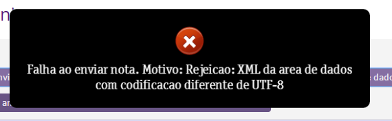

Essa mensagem de erro ocorre devido a presença de caracteres especiais tais como @#$%&* e outros sendo utilizados no cadastro do cliente ou fornecedor.

Este erro também pode ser causando quando há um " " (espaço) no fim das informações como bairro, cidade e/ou rua. Por exemplo: "Centro " != "Centro".

Em alguns estados (UFs), ao utilizar o preenchimento automático do CEP, traz o bairro com este " " (espaço) no fim causando tal erro.

Faz-se necessário a EDIÇÃO do cadastro do cliente e/ou fornecedor, removendo o caracter especial e/ou espaço no fim do campo quando houver.

Após a edição, salve e reenvie a NFe.