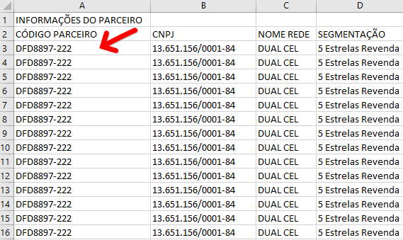
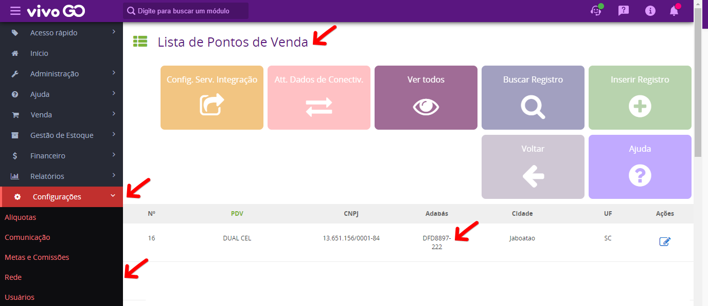
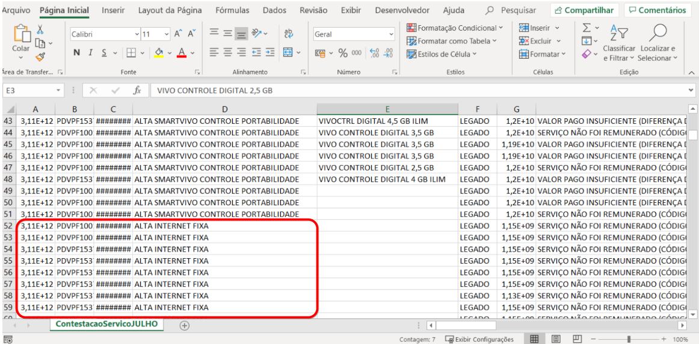
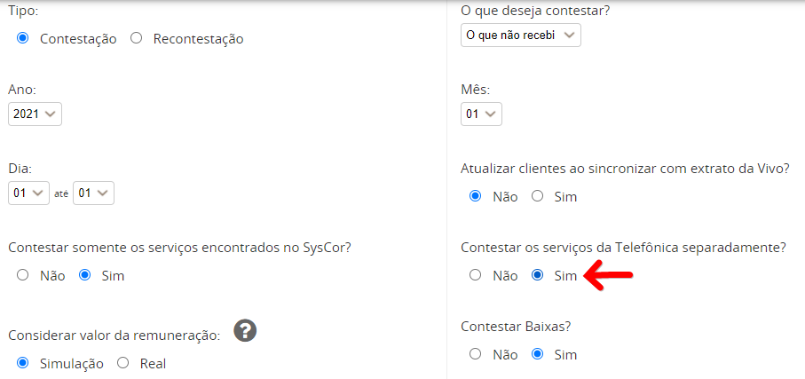
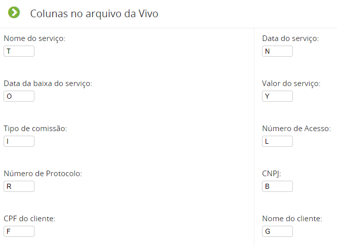
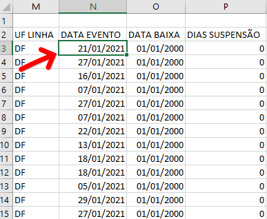

- 
Erro : Coluna: 1 (A) CNPJ inválido

Solução: Verifique e corrija removendo os pontos, barras e hífens que se encontram descritos no arquivo. Selecione a coluna “A”, clique com botão direito do mouse, selecione a opção FORMATAR CÉLULAS > ESPECIAL > OK

--------------------------------------------------------------------------------------------------------------------

- 
Erro : Código Dealer 'XXXXXX' não consta no arquivo

Solução :  Abra seu arquivo (extrato fcdi), verifique na coluna (A) a numeração do seu Adabás, ela deve estar de acordo com a numeração cadastrada no VIVO GO.

Para checar no VIVO GO, acesse o menu Configurações > Rede > Pontos de Venda ( Ver todos )

--------------------------------------------------------------------------------------------------------------------

- 
Erro : Linha : XX. Coluna : SERVIÇO não encontrado. Valor informado

Solução :  Para correção do arquivo atual basta localizar todas as linhas de fixa que estão no arquivo e excluí-las.

Para que isso não venha ocorrer nas próximas contestações no ato da inserção do arquivo no sistema, marque a opção Contestar os serviços da Telefônica separadamente? SIM

--------------------------------------------------------------------------------------------------------------------

- 
Erro : Não foi possível gerar a despesa referente à esta contestação, pois nenhum caixa da filial foi encontrado

Solução :  O gestor deve validar se o usuário possui acesso às filiais, acesso aos caixas e permissão para lançamento de despesas. Todos os itens estando de acordo, a contestação poderá ser realizada.

O usuário que está realizando o input do arquivo não possui:

1 - Acesso a uma das filiais na qual marcou para contestar

2 - Acesso ao caixa de uma das filiais que marcou para contestar

3 - Permissão para lançamento de despesas

--------------------------------------------------------------------------------------------------------------------

- 
Erro : Não foi possível gerar a receita referente à esta contestação, pois nenhum caixa da filial foi encontrado

Solução : O gestor deve validar se o usuário possui acesso às filiais, acesso aos caixas e permissão para lançamento de receitas. Todos os itens estando de acordo, a contestação poderá ser realizada.

O usuário que está realizando o input do arquivo não possui:

1 - Acesso a uma das filiais na qual marcou para contestar

2 - Acesso ao caixa de uma das filiais que marcou para contestar

3 - Permissão para lançamento de receitas

--------------------------------------------------------------------------------------------------------------------

- 
Erro : O arquivo (.csv) em anexo é inválido

Solução : Você pode validar a descrição da localização de cada item logo abaixo do campo para selecionar o arquivo a ser importado. Ele está com a descrição: Colunas no arquivo da Vivo

O arquivo que você está importando deve seguir o padrão estabelecido das colunas que o VIVO GO faz a leitura para conseguir realizar o input.

--------------------------------------------------------------------------------------------------------------------

- 
Erro : O mês ou o ano selecionado está divergente do período do extrato

Solução : Faça a validação com referência as datas e realize a exclusão das linhas que estiverem fora do prazo em que deseja contestar. Após deixar apenas serviços efetivados no mesmo período em que está configurado, salve o arquivo e tente importá-lo novamente.

--------------------------------------------------------------------------------------------------------------------

- 
Erro : Problema na leitura da data. Por favor, verifique o arquivo e tente novamente

Solução : Abra o arquivo (extrato FCDI), localize a coluna N ( Data do Evento ), corrija a descrição da data para um valor valor válido. O preenchimento deve seguir o padrão: 27/01/2020

