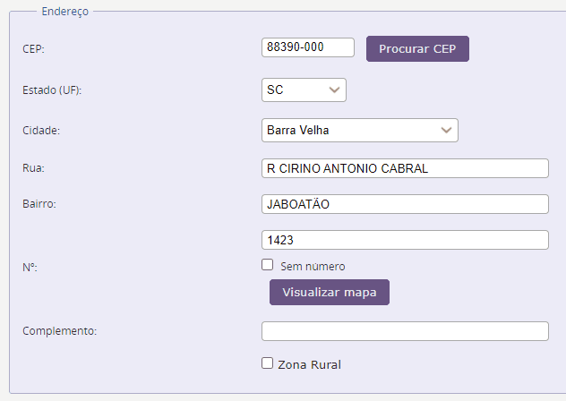
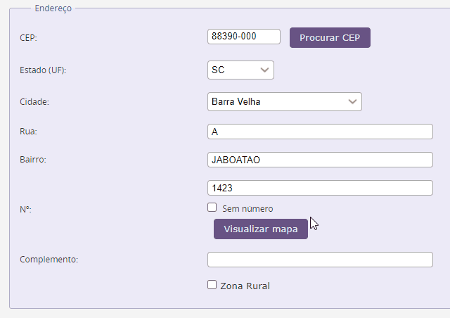
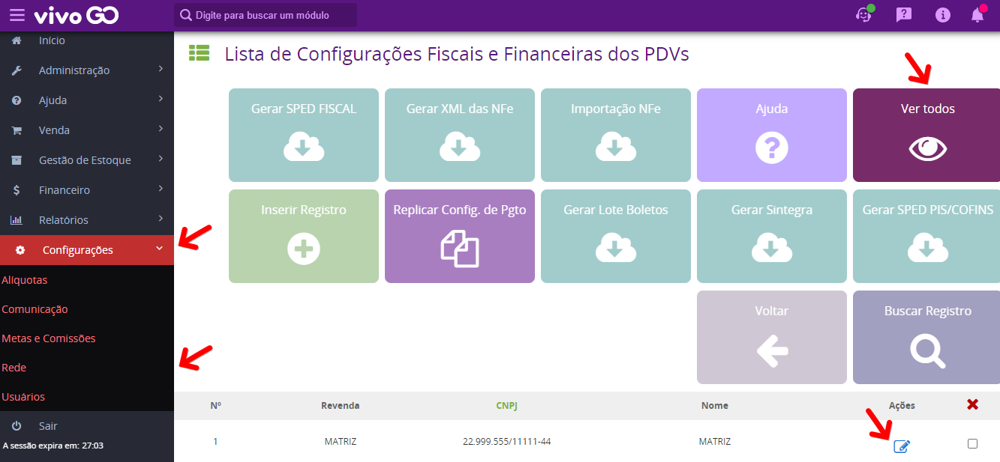
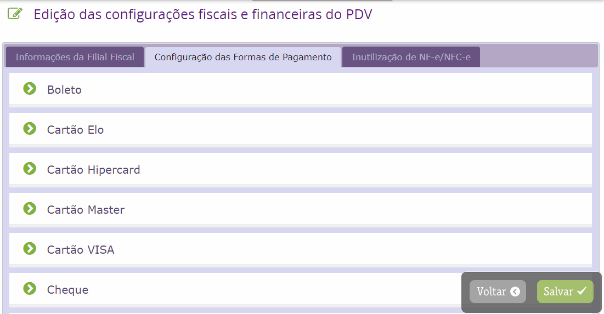
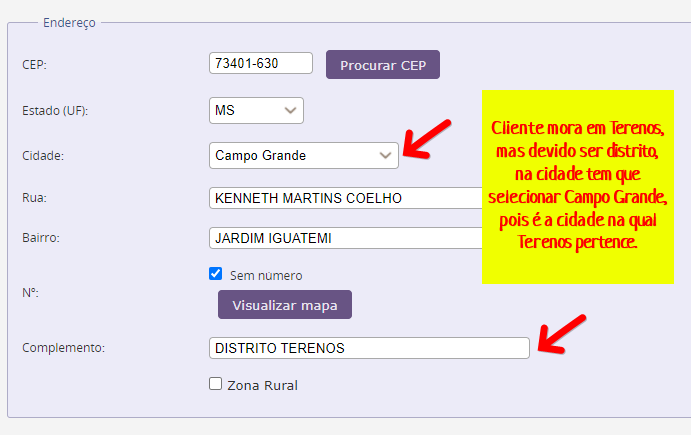
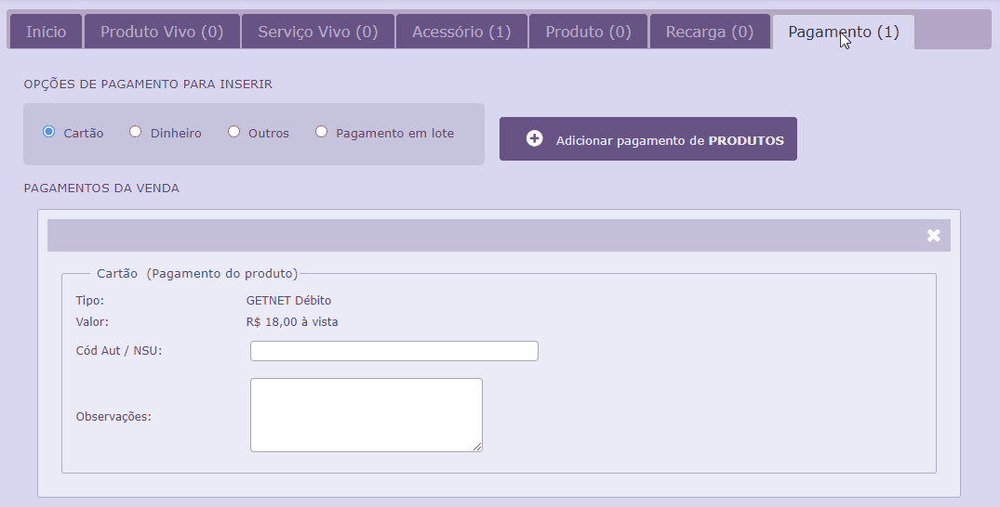
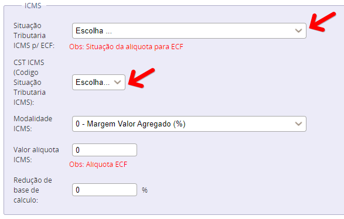

- 
Erro : XML da área de dados com codificação de UTF-8

Solução : Retire caracteres especiais e verifique se existe espaçamento no final de todas as linhas do cadastro do cliente.

Realizado o ajuste indicado acima, basta salvar e reenviar a nota.

--------------------------------------------------------------------------------------------------------------------

- 
Erro : xLgr : O valor tem o tamanho "1" ; deve ter o tamanho mínimo de "2"

Solução : Verifique o cadastro do cliente. Valide se existe alguma linha do cadastro que possui apenas 1 caractere, se existir corrija e aumente a quantidade de caracteres.

Realizado o ajuste indicado acima, basta salvar e reenviar a nota.

--------------------------------------------------------------------------------------------------------------------

- 
Erro : CNPJ : O valor '' não é aceito para o padrão.

Solução : Acesse o menu Configurações > Rede > Configurações Fiscais e Financeiras > Ver Todos / Clique para editar a filial na qual esta lançando a venda / Clique na aba Configurações das formas de pagamento / Selecione a forma de pagamento que esta sendo lançada na venda e escolha a operadora.

Realizado o ajuste indicado acima, basta salvar e reenviar a nota.

--------------------------------------------------------------------------------------------------------------------

- 
Erro : NFref: Missing child element(s).

Solução : Pode ocorrer devido três situações descritas abaixo. Identificar qual se encaixa no seu caso e alterar conforme informado.

1 - Localizar a primeira compra do produto e mudar o tipo de comprovante, para Nota Fiscal Eletrônica, inserir o numero de nota, chave de acesso e salvar.

2 - Se não houver a chave de acesso selecionar no tipo de comprovante na compra a opção Nota Fiscal e inserir o número.

3 - Pode acontecer de já estar com o tipo NOTA FISCAL, porém, o número da nota está iniciando com zeros e não pode. Ex. 005962 (errado) > 5962 (certo)

Realizado o ajuste indicado acima, basta salvar e reenviar a nota.

--------------------------------------------------------------------------------------------------------------------

- 
Erro : 'cMun': O valor "não é aceito para o padrão.

Solução : Nesse caso tem que colocar a cidade representante e colocar o distrito no complemento do endereço do cliente.

Realizado o ajuste indicado acima, basta salvar e reenviar a nota.

--------------------------------------------------------------------------------------------------------------------

- 
Erro : c'Aut' não é aceito para o padrão.

Solução : Verifique a forma de pagamento da venda e realize o preenchimento do campo Nº de autorização cartão.

Realizado o ajuste indicado acima, basta salvar e reenviar a nota.

--------------------------------------------------------------------------------------------------------------------

- 
Erro : ICMS': Missing child element(s).

Solução : Deve-se verificar o tipo de movimento de venda (se entrada ou saída). Verificar também a alíquota que esta sendo utilizada. Valide as informações com sua equipe contábil.

Realizado o ajuste indicado acima, basta salvar e reenviar a nota.

--------------------------------------------------------------------------------------------------------------------

- 
Erro : 'nat0p': O valor tem o tamanho "0", deve ter o tamanho minimo de '1'.

Solução : Verifique se as alíquotas estão cadastradas. Atenção com as alíquotas MP do Bem.

Realizado o ajuste indicado acima, basta salvar e reenviar a nota.

--------------------------------------------------------------------------------------------------------------------

- 
Erro : Cest : O valor "0"não é aceito para o padrão.

Solução :  Caso a venda seja de acessório deve-se verificar o cadastro referente ao mesmo através do menu Gestão de Estoque > Acessório > Acessório. Confirme se o campo CEST esta preenchido ou com um numero CEST válido. Para conferencia sempre verifique na NF-e do fornecedor o cest preenchido ou utilize o NCM do acessório. Você pode verificar o numero cest no site oficial do mercosul https://portalunico.siscomex.gov.br/classif/#/sumario?perfil=publico. Caso seja produto OPEN acesse o menu Gestão de Estoque > Produtos Open > Tipo Produto e efetue a mesma conferência.

Realizado o ajuste indicado acima, basta salvar e reenviar a nota.

--------------------------------------------------------------------------------------------------------------------

- 
Erro : CST informado (COD 382) .

Solução :  Acesse o menu Configurações > Alíquotas > Alíquotas, busque pela alíquota sendo utilizada na movimentação e clique para edita-la. Nas configurações da alíquota você deve selecionar os dois campos citados abaixo de acordo com a orientação da sua equipe contabil.

Campos :  "Situação Tributaria ICMS p/ ECF"  e  "CST ICMS (Código Situação Tributária ICMS)".

Após validar com sua equipe contabil e selecionar as opções adequadas salve a alíquota.
Volte na venda clique para edita-la e salve.

Realizado o ajuste indicado acima, basta salvar e reenviar a nota.

--------------------------------------------------------------------------------------------------------------------

- 
Erro : 'CEP': O valor '' não é aceito para o padrão. '[0-9]{8}'.

Solução :  O campo referente ao CEP esta em branco no cadastro do cliente, edite o cadastro do cliente preencha o campo e salve.

Realizado o ajuste indicado acima, basta salvar e reenviar a nota.
