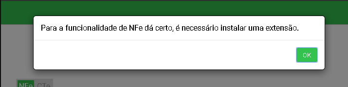
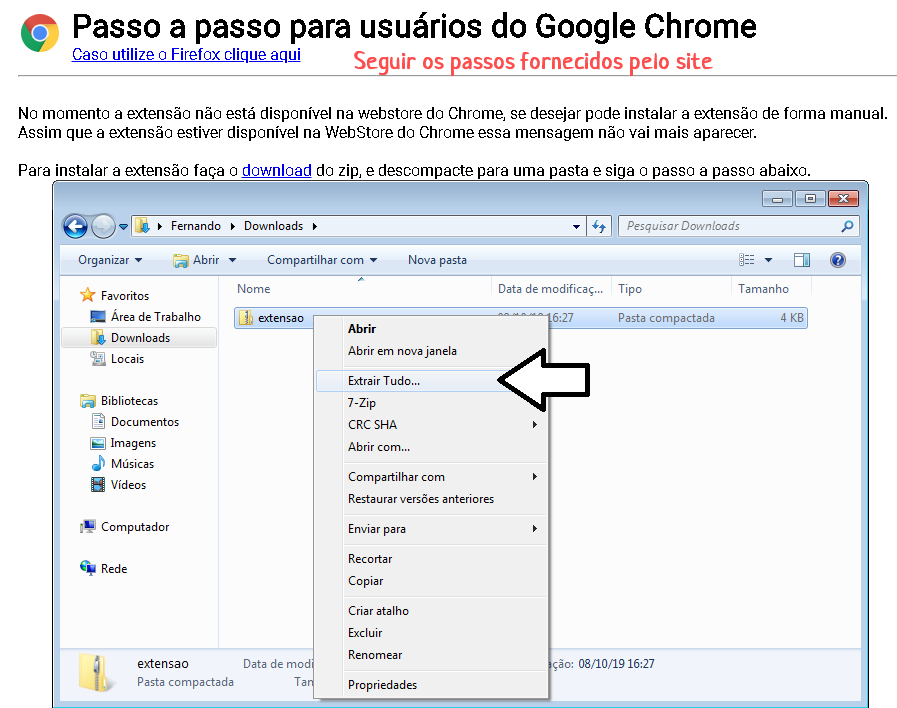

Para iniciar a compra (entrada) utilizando a importação por arquivo .XML primeiramente garanta que seu arquivo .XML não esteja corrompido ou incorreto.

Para isto:
1. Acesse o site https://www.fsist.com.br/.
2. No primeiro acesso, ao tentar baixar a NFe, é necessário instalar a EXTENSÃO do FSist.

3. Siga as instruções do site de como instalar a EXTENSÃO.

4. Informe o chave de acesso da NFe e realize o download SEM certificado.
5. No menu lateral do Vivo GO, acesse _Gestão de Estoque > Estoque > Compra > Inserir Compra_.
6. Clique em "Sim - Via arquivo .xml".
7. Clique no botão "Escolher Arquivo".
8. Busque pelo arquivo .XML que realizou o download e siga os passos para finalizar a compra.

Caso tenha dúvidas, clique [aqui](https://before.atlassian.net/wiki/spaces/SYSCOR/pages/596967469/Importa+o+Via+XML) e veja o passo a passo em nosso manual.
