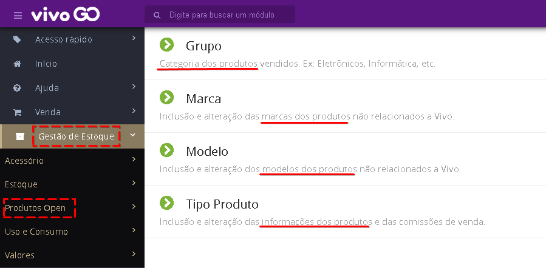
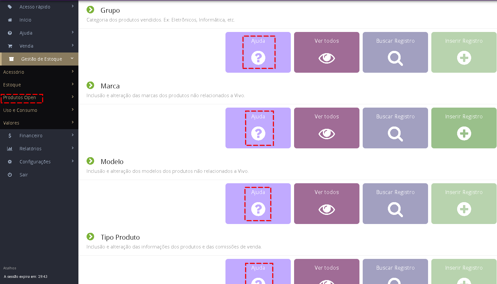

Provavelmente o modelo desejado não está devidamente cadastrado no Vivo GO.
Os Produtos Open podem ser variados, então o Vivo GO permite que você cadastre conforme sua necessidade qualquer tipo, marca e modelo de acessório e/ou produtos que deseja vender em sua loja.

No menu lateral, acesse "Gestão de Estoque > Produtos Open" e então cadastre conforme sua necessidade.

Recomendamos seguir a ordem de cadastro/verificação: Grupo, Marca, Tipo e Modelo.
Para usar todos os recursos do sistema Vivo GO e ter relatórios precisos, você deve cadastrar de forma correta. Caso já tenha o Grupo, Marca, Tipo ou Modelo cadastrado, apenas confirme que as informações estão corretas.

Cada uma das opções possui seu tutorial com vídeo-aula explicativo. Basta clicar no botão Ajuda caso tenha alguma dúvida.

Ou clique nos links para acessar:
[Grupo e Marca](https://before.atlassian.net/wiki/spaces/SYSCOR/pages/10289193/Grupo+e+Marca), 
[Modelo](https://before.atlassian.net/wiki/spaces/SYSCOR/pages/587628586/Modelo), 
[Tipo](https://before.atlassian.net/wiki/spaces/SYSCOR/pages/1540122/Tipo+Produto).

> NCM (Nomenclatura Comum do Mercosul) - Confirme junto ao contador o correto para cada produto - Este número não possui . - / ou qualquer caracter especial.

> CEST (Código Especificador da Substituição Tributária) - Caso não seja preenchido de forma automática após preencher o NCM, consulte seu contador.

> GTIN (Código de barras do produto)