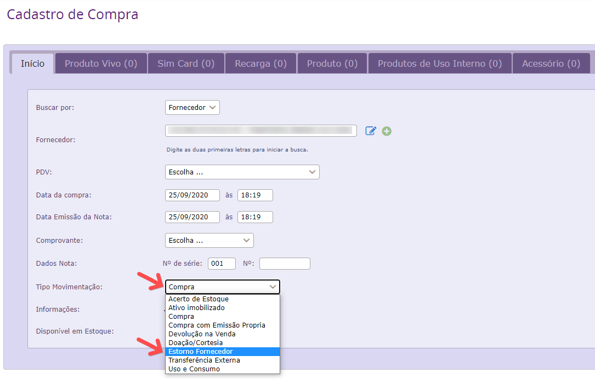

Emiti uma nota fiscal de saída de produtos com informações incorretas (CNPJ, CFOP, etc). Agora o prazo de cancelamento desta nota foi ultrapassado e o destinatário recusou o recebimento. O que fazer ?

Primeiramente o produto deve voltar ao estoque do Vivo GO através de uma nova compra em Gestão de Estoque > Estoque > Compra com o Tipo Movimentação : Estorno Fornecedor, utilizando as informações da nota de saída incorreta no preenchimento.

Para preenchimento dos campos da compra, acesse este link do manual do sistema:

https://before.atlassian.net/wiki/spaces/SYSCOR/pages/587399216/Compra

OBS: A CFOP a ser selecionada deve ser o oposto da nota de saída incorreta !
Exemplo: Se a nota de saída foi emitida com uma CFOP 5202, a compra deve ser selecionada 1202, assim por diante.
Depois do produto voltar ao estoque, basta fazer uma nova saída deste produto com as informações corretas.
