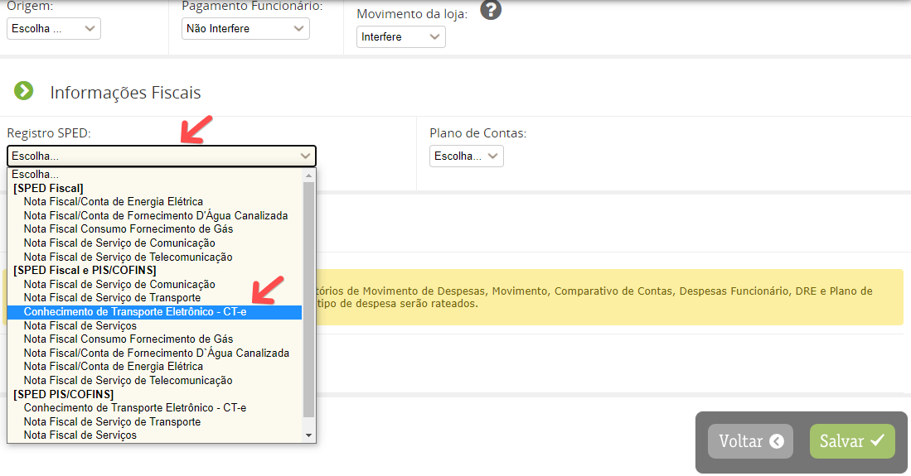
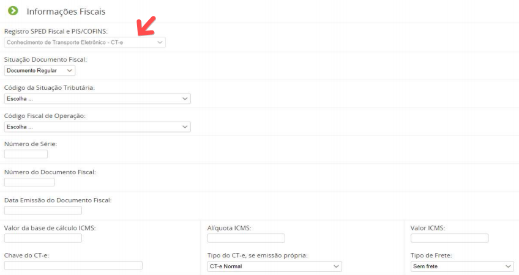

Para fazer o lançamento do CT-e no sistema você deve primeiro cadastrar o TIPO DE DESPESA correspondente, acessando o menu Financeiro > Contas a Pagar > Tipo de Despesa > Inserir Registro.

No campo REGISTRO SPED deve informar o registro CT-e conforme demostrado na imagem abaixo :

Depois de cadastrado o TIPO DE DESPESA, deve fazer o lançamento do documento pelo menu Financeiro > Contas a Pagar > Despesa > Inserir Registro e marcar o TIPO DE DESPESA cadastrado que abrirá os campos adequados para o lançamento do documento.

Todos os lançamentos que utilizam o Registro Sped são informados no arquivo Sped gerados pelo sistema e para o
lançamento de uma receita o procedimento é o mesmo, mudando apenas o local de lançamento para Financeiro >
Contas a Receber.
