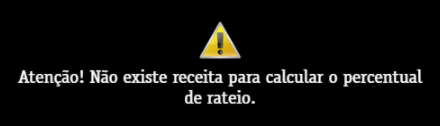
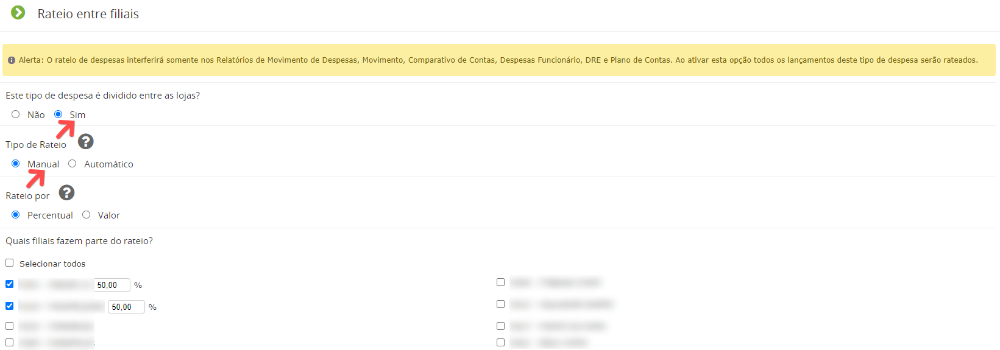

Ao tentar fazer o realizar o rateio de uma despesa acusa: "Atenção! Não existe receita para calcular o percentual de rateio".

É necessário editar o tipo de despesa que está vinculado a este movimento, selecionar a opção manual e selecionar as filiais que farão parte do rateio desse tipo de despesa.

