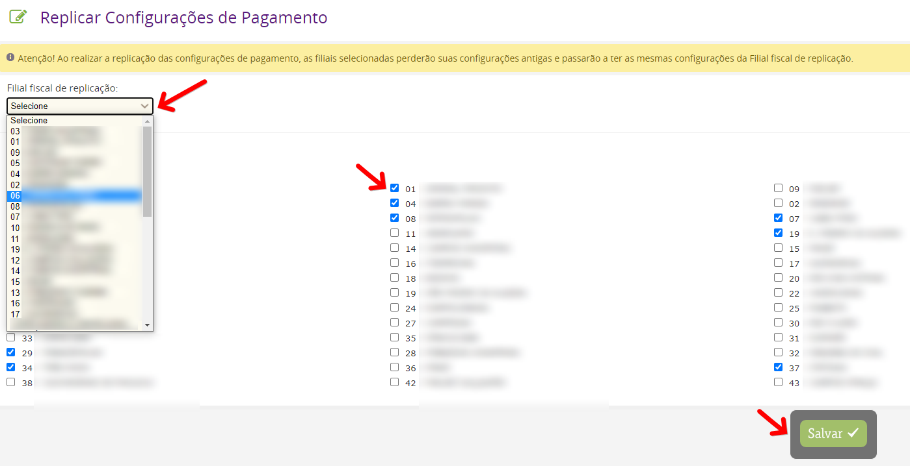

Fiz a configuração das taxas de parcelamento em todas as formas de pagamento cartão, as taxas são as mesmas para todas as filiais, tenho que repetir o mesmo processo em todas as filiais ?

Após finalizar a configuração em uma das filiais, você pode REPLICAR para as outras clicando em Replicar Config. de Pgto. Acessando Configurações > Rede > Configurações Fiscais e Financeiras e clicando no botão ( Replicar Config. de Pgto ) o sistema abrirá uma tela onde você pode selecionar a filial que já configurou e marcar as demais para receberem a mesma configuração automaticamente.

