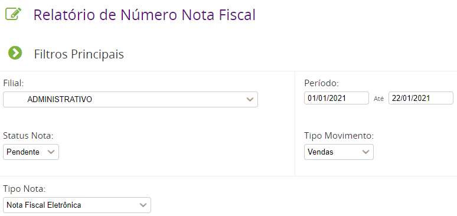

É possivel gerar o relatório número de notas através do menu :

- Relatórios > Movimento > Número Nota fiscal

Neste relatório você pode listar todas as notas emitidas em um determinado período, filtrando por : filial, status nota, tipo movimento, tipo nota e período.

Além da visualização via página da web clicando em SALVAR também é possivel exportar este relatório para excel. Para isso basta clicar na opção EXPORTAR.
O arquivo será baixado contendo todas as informações filtradas da maneira em que foram selecionadas.

Caso o menu indicado não apareça para seu usuário é necessario que solicite ao seu gestor que libere acesso ao caminho para sua função ou que ele mesmo gere o relatório.

