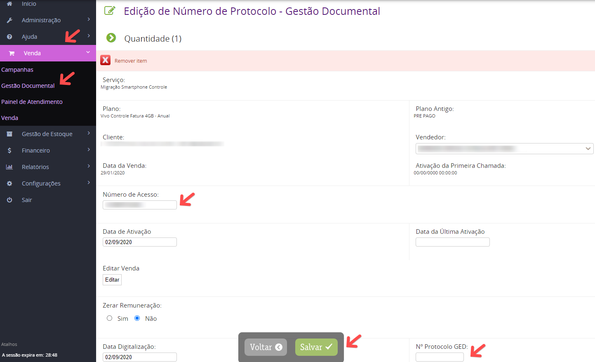

Salvei uma venda e emiti nota fiscal para o cliente, mas o número de acesso e os protocolos da operadora estão incorretos. É possível corrigir ?

Se a sua função possuir a permissão de alterar vendas concluídas liberada, basta você clicar no ícone da venda para editar, realizar as alterações necessárias e salvar.

Você tambem pode realizar tal alteração acessando o menu Venda > Gestão Documental > Gestão Documental. Busque pela venda em questão e clique no ícone para editar. Faça as alterações e clique em Salvar.

Obs: Caso você não possua permissão para realizar um dos dois processos, procure o seu BKO. Ele é o responsável pela auditoria das vendas da loja, e possui acesso para fazer este tipo de alteração.
