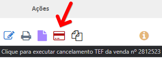
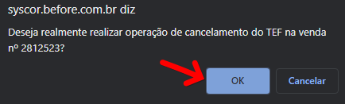
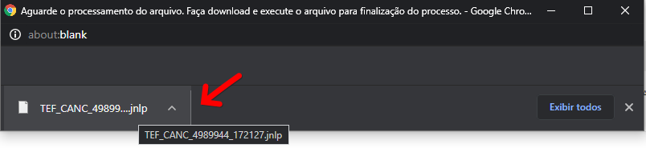
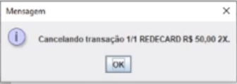
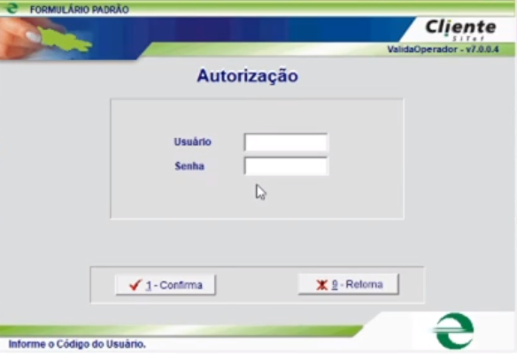
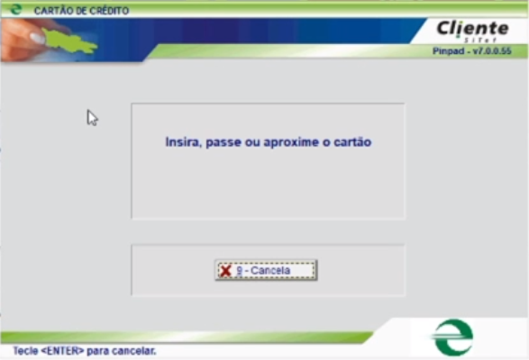
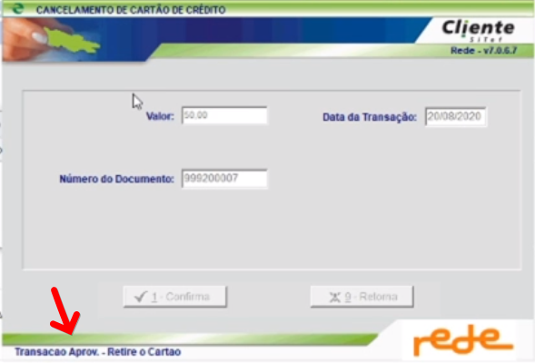

Primeiramente localize a venda em questão no menu __Venda > Venda > Venda ( Buscar Registro )__

Após localizar a venda clique no icone do cartão que está em vermelho.

Abrirá uma pop-up para confirmação do cancelamento, basta clicar em OK.

Após clicar em OK o sistema exportará um arquivo no formato java para ser executada a operação de cancelamento, basta aguardar o download do arquivo e logo após clicar para executa-lo.

Clicando para executar o arquivo baixado será aberta uma pop-up de para confirmação, basta clicar em OK.

Será requisitado para que autentique sua senha, para confirmação do cancelamento.

Basta digitar no campo __Usuário : 1__ , __Senha : 1__ e por final clicar no botão _Confirma_

Feito isso o aplicativo solicitará para que seja inserido o cartão do cliente, basta inseri-lo e aguardar a confirmação de que a transação foi estornada.

