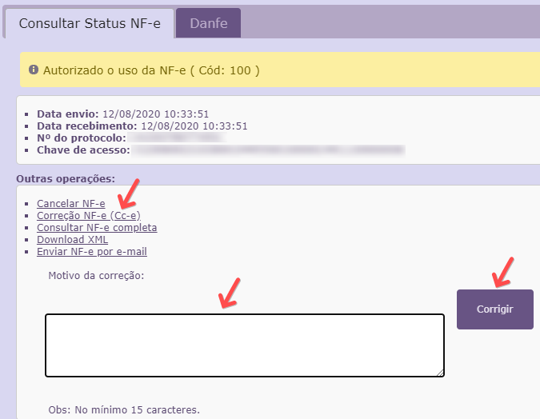

A Carta de Correção Eletrônica (CC-e) é um documento fiscal utilizado para corrigir erros de NF-e já emitidas. Obs: Não
se aplica carta de correção para NFC-e, apenas para NF-e.

O que pode ser corrigido :

- CFOP (Código Fiscal de Operação e Prestação), desde que não mude a natureza dos impostos;
- Descrição da Mercadoria;
- CST (Código de Situação Tributária), desde que não haja alteração de valores;
- Peso, volume, acondicionamento do item, desde que não interfira na quantidade faturada do produto;
- Data de Saída (desde que seja no mesmo período de apuração do ICMS);
- Dados do Transportador – Endereço do destinatário (desde que não altere por completo);
- Razão Social do Destinatário (desde que não altere por completo);
- Inserir ou alterar dados adicionais, como por exemplo, transportadora, nome do vendedor, número do pedido.

O que não pode ser corrigido :

- Valores fiscais que determinam o valor do imposto, tais como: base de cálculo, alíquota, diferença de preço,
quantidade, valor da operação;
- Correção de dados cadastrais que implique mudança do remetente ou do destinatário;
- Descrição da mercadoria que altere as alíquotas de impostos;
- Destaque de Impostos ou quaisquer outros dados que alterem o Cálculo ou a Operação do Imposto.

Abaixo, alguns exemplos do que pode ser escrito na carta de correção eletrônica:

“Altera-se o número de volumes de 18 para 20”
“Altera-se a transportadora utilizada de: Transportadora ABC LTDA para Transportadora XYZ LTDA”
“Altera-se o peso total de 100 para 140kg”
“No campo descrição do produto, Onde se lê: vestido amarelo Leia-se: vestido vermelho.”

Como emitir uma carta de correção (CC-e) pelo Vivo Go ?

É necessário acessar o movimento em que foi emitida a NF e clicar no ícone de emissão da nota (QR-code verde) irá abrir a tela demostrada abaixo, onde basta clicar na opção Correção NF-e (Cc-e) digitar a correção a ser feita e salvar clicando em CORRIGIR.

A CC-e pode ser consultada pela mesma tela clicando em Consultar NF-e completa. Lembrando que a SEFAZ
disponibilizar a carta no ambiente após algumas horas.
