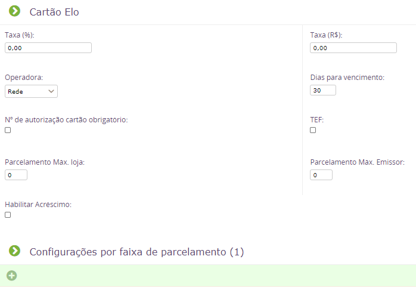
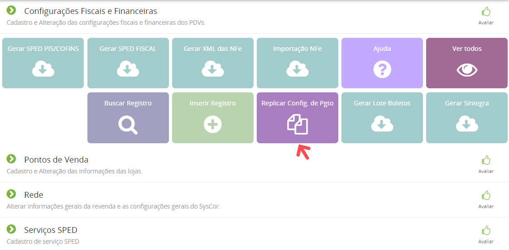

Tentei fazer a conciliação de cartões e o sistema não encontrou os registros.
Verifiquei que tem os lançamentos das contas a receber mas o sistema não localiza na conciliação fica em datas diferentes do extrato.

Para que o sistema localize as movimentações nas tatas corretas, antes de iniciar o uso da conciliação você deve configurar as formas de pagamento no menu Configurações > Rede > Configurações Fiscais e Financeiras, edite o cadastro de uma das filiais e na aba formas de pagamento, defina os parâmetros a serem usados pelo sistema.
Selecione a operadora de cartões, a quantidade de dias para o vencimento e as taxas, inclusive as taxas por parcelamento.

Lembrando que o sistema irá usar essas configurações para as vendas a partir do momento em que foram realizadas as alterações na configuração. Outro ponto é que a configuração é feita por filial, então, após terminar a primeira filial você pode usar o botão replicar config. financeiras para que os dados informados sejam replicados para todas as outras filiais do grupo.

