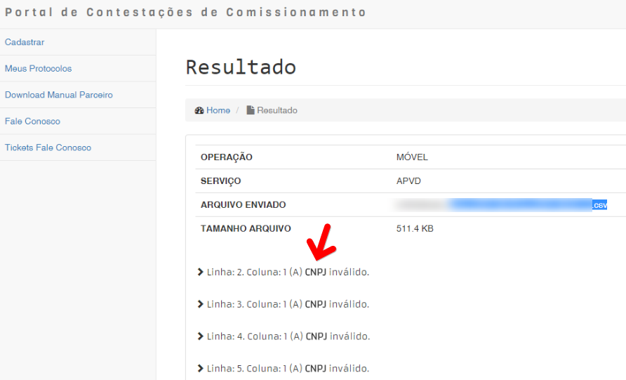
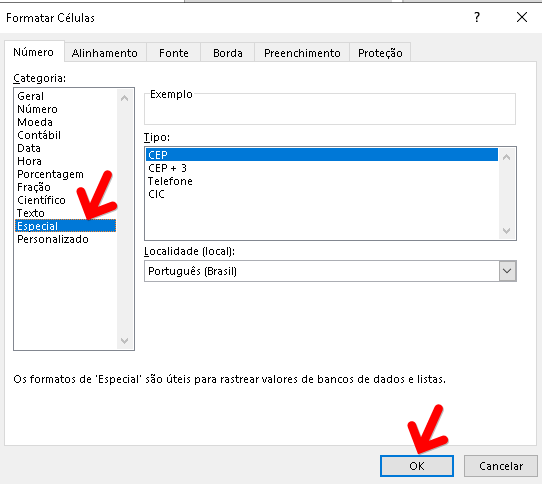

Motivo: Os dados contidos na coluna "A" CNPJ possuem caracteres especiais.

Solução: Verifique e corrija removendo os pontos, barras e hífens que se encontram descritos no arquivo. Selecione a coluna "A", clique com botão direito do mouse, selecione a opção FORMATAR CÉLULAS > ESPECIAL > OK

> Exemplo de correção:
>
> CNPJ 11.222.333/4444-55, corrigir para CNPJ 11222333444455