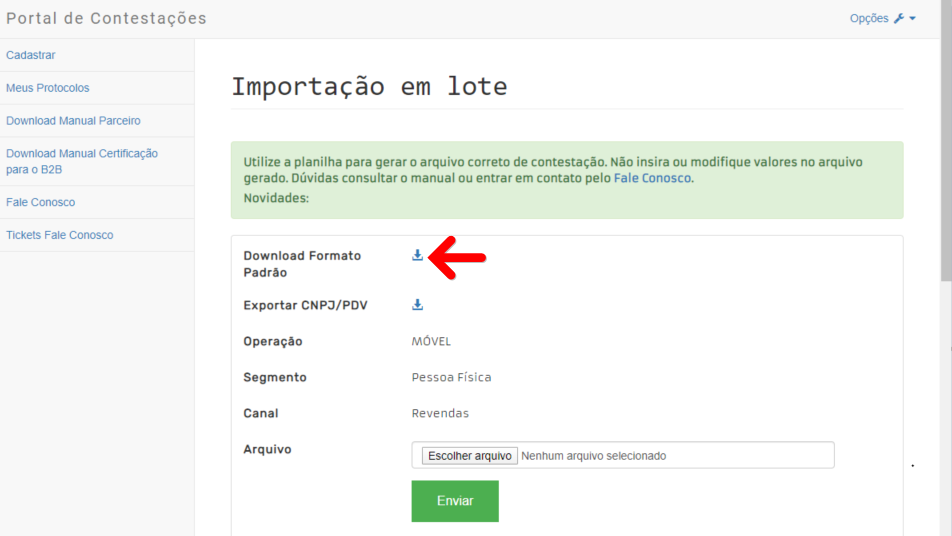

Motivo: O arquivo que você esta anexando está desconfigurado. O VIVO GO faz a leitura de todas as colunas do seu arquivo e deve seguir o padrão estabelecido.

Solução: Você pode validar a descrição da localização de cada item logo abaixo do campo para selecionar o arquivo a ser importado. Ele está com a descrição: _Colunas no arquivo da Vivo_

O arquivo que você está importando deve seguir o padrão estabelecido das colunas que o VIVO GO faz a leitura para conseguir realizar o input.
