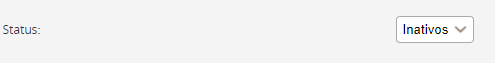
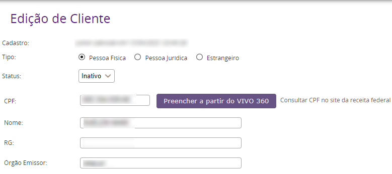

A tentar efetuar o cadastro de um cliente o sistema gera a seguinte mensagem "CPF/CNPJ já está cadastrado" mas o tentar lançar o CPF/CNPJ em uma venda ele não aparece.

__Solução:__

- Acesse o menu  Vendas > Vendas > Cliente > Buscar Registro
- Cole o CPF/CNPJ do cliente e na última opção da página coloque o status como INATIVO e clique em buscar.

Caso o sistema gere um resultado para a busca clique em EDITAR e na pagina que se abre mude o status para ATIVO e por final clique em SALVAR.

