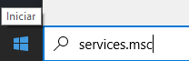

- Primeiramente feche o eficaz.

- Clique no menu Iniciar do seu sistema operacional e digite : services.msc aparecerá um aplicativo chamado "Serviços", clique para executa-lo.

- Procure pelos serviços IntegradorPAF / Firebird Guardian / Firebird Server e reinicie-os clicando com o botão direito do mouse em cima de cada um dos serviços.

- Feito isso, basta abrir o eficaz novamente.

(Obs : As vendas serão sincronizadas de 30 em 30 segundos)
