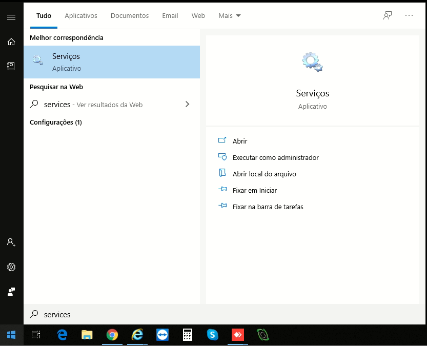

Para que seja realizado o sincronismo dos cupons fiscais é necessário que você siga todo o passo a passo abaixo.

- Feche o Eficaz.

- Clique no menu Iniciar do seu sistema operacional e digite : services.msc aparecerá um aplicativo chamado "Serviços", clique para executa-lo.

- Procure pelos serviços IntegradorPAF / Firebird Guardian / Firebird Server e clique para reiniciar cada um dos serviços.

- Feito isso, basta abrir o eficaz novamente.

( Obs : As vendas serão sincronizadas de 30 em 30 segundos )
