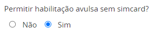
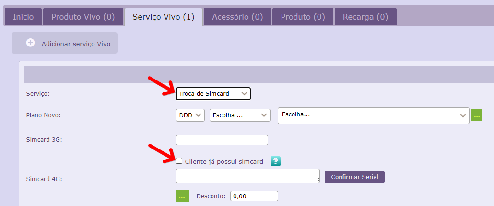

No lançamento de uma alta o sistema obriga que faça a venda de um simcard, pois é uma habilitação. Casos onde o cliente já possui um simcard são caracterizados como "alta avulsa". Nesse caso deve-se habilitar uma permissão a filial para lançar esse tipo de "alta" sem um simcard do estoque.

Acesse o menu Configurações > Rede > Pontos de Venda, busque pela sua filial e após na coluna "Ações" clique em "Editar", role a pagina para baixo e busque a opção "permitir habilitação de venda avulsa sem simcard" marque-a como "SIM" e após clique em salvar.

Fora isso a única opção que permite fazer um lançamento de vendas de serviço sem simcard é na opção Troca de simcard.  Efetue o lançamento do serviço de troca e marque a opção "cliente ja possui simcard" após isso basta preenche o campo referente ao numero da linha do cliente e prosseguir com a venda.

Caso nao possua acesso a essas informações solicite a seu gestor para que realize as alterações.
