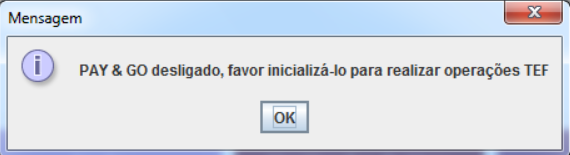
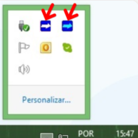

Tentei passar um cartão e deu erro __"Pay & GO desligado, favor inicializa-lo para realizar operações TEF", como resolvo ?__

Primeiramente verifique se o Pay&GO servidor e Pay&GO cliente estão sendo executados.
Para validar verifique conforme imagem abaixo.

Caso não estejam sendo executados clique no menu Iniciar do seu computador e pesquise por Pay&Go Servidor e Pay&GO Cliente. É necessário que os dois estejam sendo executados.
___

Após inicializar os dois aplicativos tente efetuar a transação TEF novamente.
