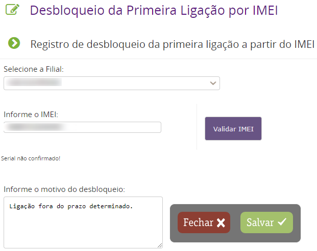

Existe um prazo determinado na configuração do PDV. Esse prazo especifica o intervalo entre a ligação e a venda. Caso ultrapasse o tempo estipulado é necessário que seu gestor faça a liberação do IMEI em questão. Para isso ele deve acessar :

__Venda > Venda > Venda ( Primeira Ligação por IMEI )__

Ele irá selecionar a filial de venda, o IMEI e o motivo do desbloqueio.

Realizado o procedimento acima você já pode finalizar a venda.
