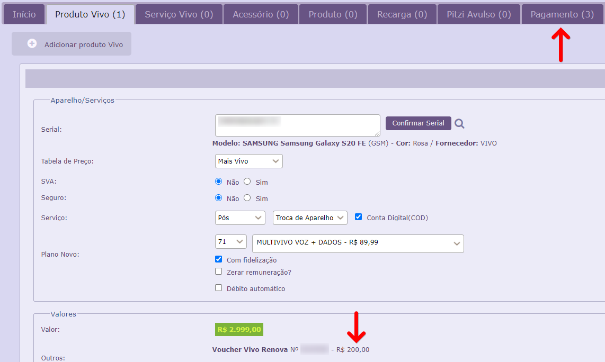
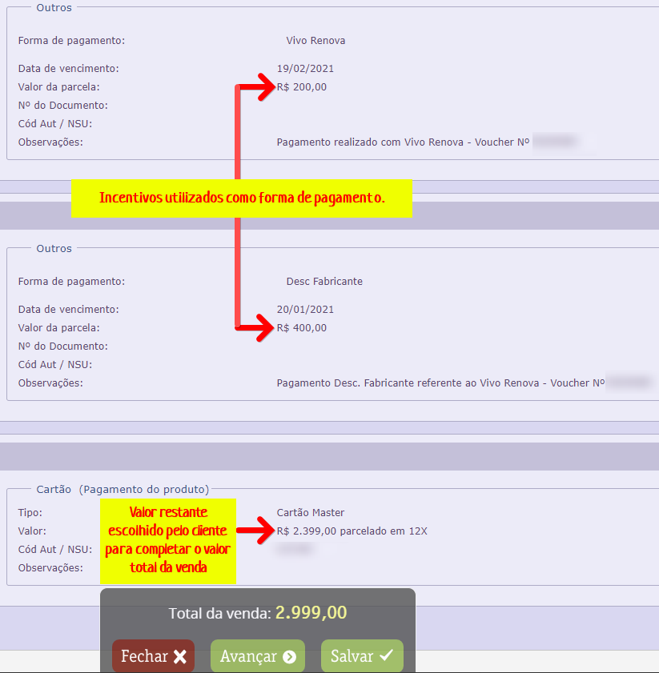

Fiz uma venda e adicionei voucher do renova e desconto fabricante, porem não alterou o valor da venda.

Vendas que possuem _Vivo Renova_ e _Desconto Fabricante_ não alteram o valor final da venda.

Eles são incentivos e servem como forma de pagamento. Basta que seja informado o valor da diferença com a forma de pagamento que o cliente desejar.

Segue abaixo exemplo de uma venda lançada utilizando voucher's :

Tem dúvidas quanto ao lançamento ou requisitos clique [AQUI](https://before.atlassian.net/wiki/spaces/SYSCOR/pages/66883846/Lan+amento+Vivo+Renova)
