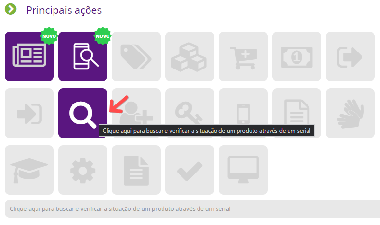

Bipei o serial do produto na venda e cliquei em confirmar, mas aparece a mensagem “Nenhum produto encontrado com este serial”.
O que posso fazer ?

Neste cenário existem duas possibilidades :

1 - O produto teve alguma movimentação anterior à venda;
2 - O produto não está no estoque do Vivo GO

Em ambos os casos podemos confirmar facilmente com o relatório Situação de Produto, clicando neste ícone na tela inicial do Vivo GO.

Ou se preferir acesse o menu :

- Relatórios > Estoque > Situação

Com este relatório você vai confirmar :

Se o produto não está mais em seu estoque, mostrando as movimentações que o produto possui (transferência para outra filial, saída de produto do estoque, etc)

Se o produto ainda não foi inserido no estoque por meio de uma compra, mostrando a mensagem “Nenhum registro encontrado”
