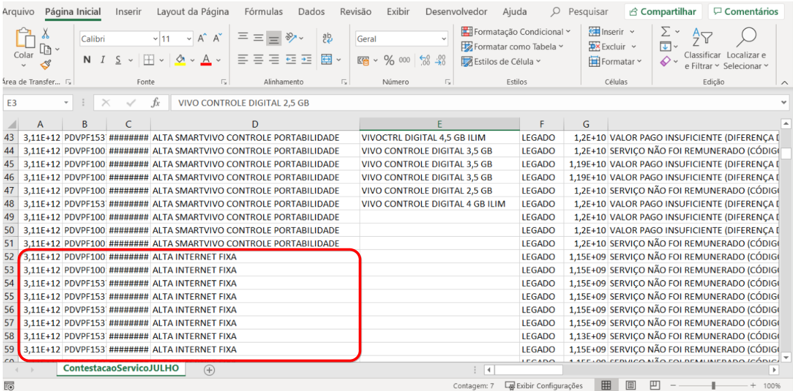

Motivo: Os serviços da FIXA estão sendo contestados em conjunto com a móvel, o que torna o processo de contestação incorreto devido a normativa deliberada pela Operadora a partir de 01/04/2019, onde deve ser contestada separadamente utilizando o canal Revendas Fixa no Portal de contestação. No arquivo você consegue observar que a coluna E esta vazia ( sem preenchimento )

Solução: Para correção do arquivo atual basta localizar todas as linhas de fixa que estão no arquivo e excluí-las. Para que isso não venha ocorrer nas próximas contestações no ato da inserção do arquivo no sistema, marque a opção _Contestar os serviços da Telefônica separadamente?_ SIM

